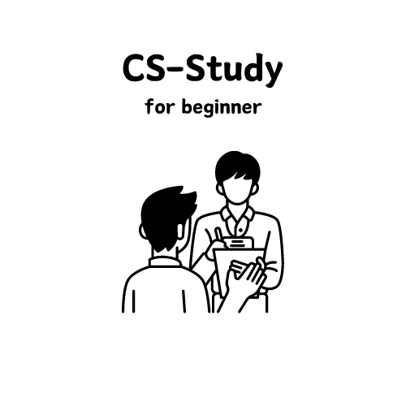

  

# CS-study
서로 수정하고 추가하는 CS 스터디

# Contents
- OS, 네트워크, 자료구조, 웹, DB...
- 각 목차에 맞게 추가 및 수정 가능

# Real Interview
- 실제 면접 질문들로 구성

# How to Solve
- 프로젝트나 과제 중 문제가 발생했을 때, 해결한 방법 (어떻게 그런 생각을 하게 되었는지 인사이트와 기술 위주)

# 그 외 추천자료
- 책, 강의 등 추천 자료 정리

# 참고 사이트 
[Tech Interview For Beginner](https://github.com/JaeYeopHan/Interview_Question_for_Beginner?tab=readme-ov-file)
